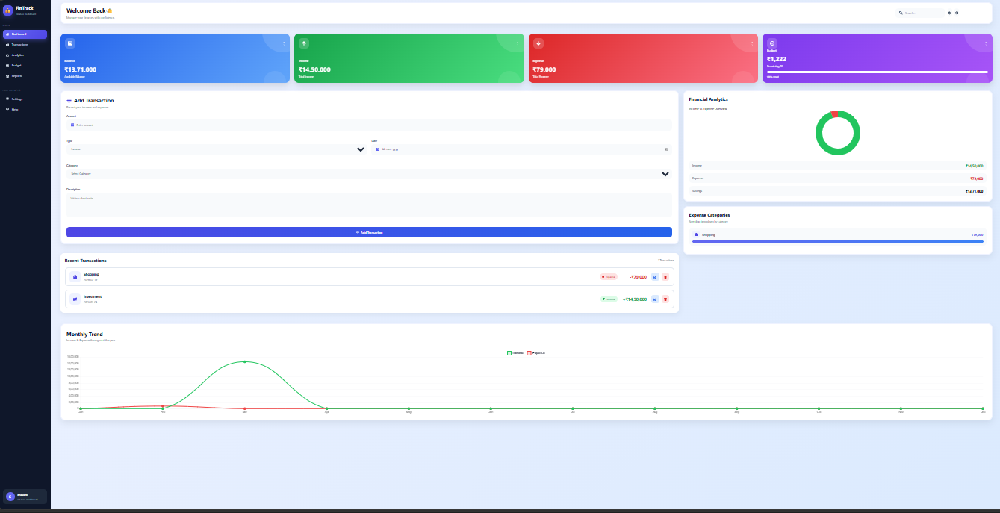
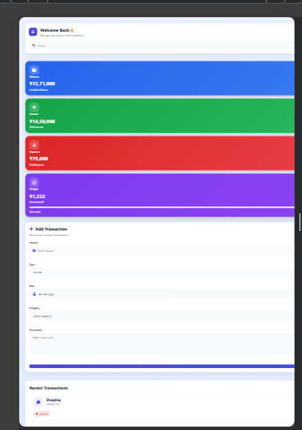
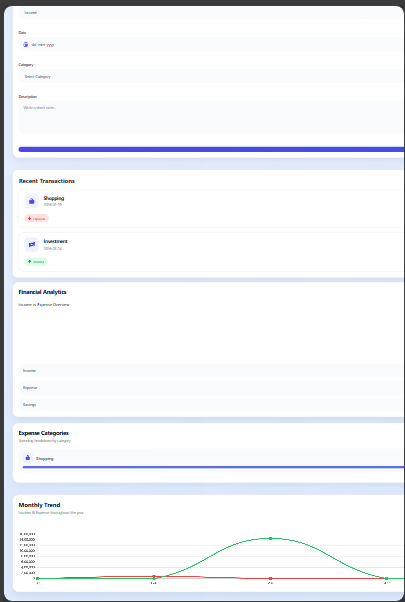

# 💰 FinTrack Dashboard

A modern and responsive personal finance dashboard built with React and Vite. Manage your income, expenses, budgets, and visualize financial insights through interactive charts.

## 🚀 Live Demo

👉 https://fintrack-dashboard-pi-nine.vercel.app/

## 📂 GitHub Repository

👉 https://github.com/Sravani-1210/fintrack-dashboard

---

## ✨ Features

- 💳 Add Income & Expense Transactions
- ✏️ Edit Transactions
- 🗑 Delete Transactions
- 🎯 Budget Management
- 📊 Financial Analytics Dashboard
- 📈 Monthly Income & Expense Trend
- 🏷 Expense Category Analysis
- 💾 Local Storage Persistence
- 📱 Fully Responsive Design
- 🎨 Modern Dashboard UI

---

## 🛠 Tech Stack

- React.js
- Vite
- JavaScript (ES6)
- CSS3
- Chart.js
- React Icons
- Local Storage
- Git & GitHub
- Vercel

---

## 📸 Screenshots

### 🖥️ Dashboard



### 📱 Mobile View



### 📱 Mobile View 2


---

## ⚙ Installation

Clone the repository

```bash
git clone https://github.com/Sravani-1210/fintrack-dashboard.git
```

Go to the project

```bash
cd fintrack-dashboard
```

Install dependencies

```bash
npm install
```

Run the project

```bash
npm run dev
```

---

## 👩‍💻 Developer

**Sravani**

GitHub:
https://github.com/Sravani-1210

---

## ⭐ If you like this project, give it a star.****
